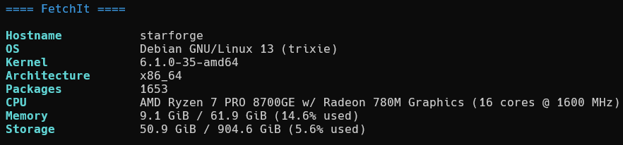

# Fetchit

A command-line system information fetching tool.

## Supported Operating Systems
Support for amd64 (x86_64), (untested for arm)

- Debian 11 (Bullseye)
- Debian 12 (Bookworm)
- Debian 13 (Trixie)
- Ubuntu 20.04 LTS (Focal)
- Ubuntu 22.04 LTS (Jammy)
- Ubuntu 24.04 LTS (Noble)
- Ubuntu 25.04 (Oracular) !1


!1 - When released 

## Overview

Fetchit is a lightweight system information tool written in C that displays system details in a clean, customizable format.

## Installation

### Install with Debian

```bash
# Without wheel
apt install fetchit

# With wheel
sudo apt install fetchit
```

### Prerequisites

- GCC compiler
- Make

### Building from source

```bash
# Clone the repository
git clone https://github.com/NotKeira/fetchit.git

# Navigate to the directory
cd fetchit

# Build the project
make
```

## Installation from source

```bash
# Clone the repository
git clone https://github.com/NotKeira/fetchit.git

# Navigate to the directory
cd fetchit

# Install
sudo make install
```

## Usage

```bash
fetchit
```



## Features

- System information display
- Lightweight and fast execution
- Customizable output format

## Contributing

1. Fork the repository (`git clone https://github.com/NotKeira/fetchit.git`)
2. Create your feature branch (`git checkout -b feature/amazing-feature`)
3. Commit your changes (`git commit -m 'Add some amazing feature'`)
4. Push to the branch (`git push origin feature/amazing-feature`)
5. Open a Pull Request

## License

This project is licensed under the MIT License - see the [LICENSE](LICENSE) file for details.
